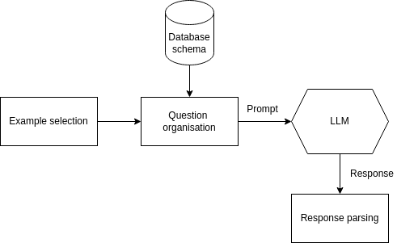

# text2sql

# Project description
## Problem statement
The goal of the project is to develop an LLM-based method to translate natural language questions to executable SQL queries.
The accuracy of the method is evaluated against the validation subset of the Spider dataset by comparison with the expected SQL query, the execution results and execution time.

## Implementation


We implemented the following structures of prompts of zero-shot (no examples) and few-shot (several examples) learning:
- Example organizations: Full Text, SQL only and DAIL-SQL. 
- Example selection strategies: Random, Question Similarity (QTS), Masked Question Similarity (MQS), and Query Similarity Selections (QSS)

The evaluation was done using exact-set-match accuracy (EM), execution accuracy (EX) and execution time.

Besides that, we added LoRA fine-tuning on LLM to improve accuracy.

## Evaluations
We have run experiments on [Ministral-8B-Instruct-2410](https://huggingface.co/mistralai/Ministral-8B-Instruct-2410) and [Meta-Llama-3.1-8B-Instruct](https://huggingface.co/meta-llama/Llama-3.1-8B-Instruct).
Results are present on the following plot:


Fine-tuning with LoRA of [Meta-Llama-3.1-8B-Instruct](https://huggingface.co/meta-llama/Llama-3.1-8B-Instruct) improved the performance over the majority of the prompt-organisations. On the following plot we display comparison of executing accuracy on basicLlama-3.1-8B and its fine-tuned version with LoRA.


# How to run code?

## Installation & Setup

To access Hugging Face models, create a `.env` file in the root folder of this project and paste your Hugging Face access token there.

```
// .env
HF_TOKEN={your access token}
```

Install necessary dependencies:

```bash
pip install transformers bitsandbytes accelerate datasets outlines scikit-learn python-dotenv nltk gdown peft nltk
```

## Prediction

To run the evaluation script, you first need to generate files with predictions.

To do that, run the following command:

```bash
python main.py predict

# or

python main.py predict --params_path params_llama.yaml
```

The files will be generated in the `results` folder.

## Evaluation

The evaluation script is based on that from https://github.com/taoyds/spider/tree/master.

Before running the script, please make sure to download the databases from the test suite and place them in the root directory of this project:

```bash
gdown 1mkCx2GOFIqNesD4y8TDAO1yX1QZORP5w
unzip testsuitedatabases.zip -d text2sql
```

```bash
python main.py evaluate

# or

python main.py evaluate --params_path params_llama.yaml
```

## Fine-tuning

To fine-tune LLM with QLoRA, add `fine_tune` block to your `params.yaml` and run:
```bash
python main.py fine-tune

# or

python main.py fine-tune --params_path params.yaml
```
